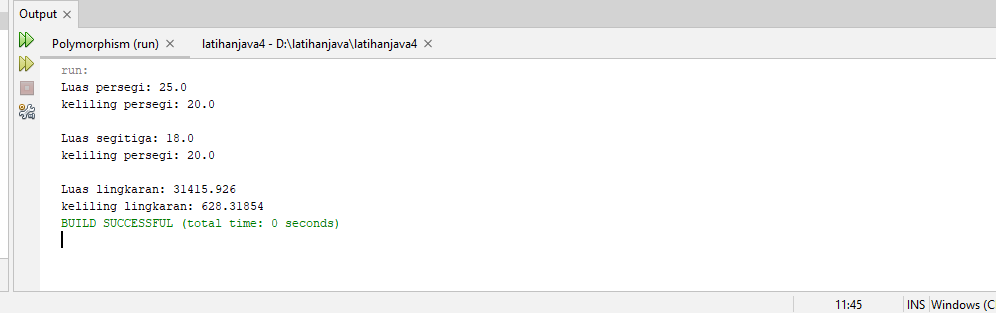

# latihanjava4
___
### Program menghitung luas dan keliling bangun datar

• Mendeklarasikan <i>class Bangundatar</i> yang merupakan superclass
```java 
       public class Bangundatar {
            float luas() {
                return 0;
            }
            float keliling() {
                return 0;
            }
        }
```
• Mendeklarasikan <i>class lingkaran</i> yang merupakan subclass dari <i>class Bangundatar</i>
```java 
        public class lingkaran extends Bangundatar {
            int r;
            public lingkaran(int r) {
                this.r = r;              
            }
            @Override
            public float luas() {
                return (float) (Math.PI * r * r);
            }
            @Override
            public float keliling() {
                return (float) (2 * Math.PI * r);
            }
            
        }
```
• Mendeklarasikan <i>class persegi</i> yang merupakan subclass dari <i>class Bangundatar</i>
```java 
        public class persegi extends Bangundatar {
            int sisi;
            public persegi(int sisi) {
                this.sisi = sisi;
            }
            @Override
            public float luas() {
                return this.sisi * this.sisi;
            }
            @Override
            public float keliling(){
                return this.sisi * 4;
            }
        }
```
• Mendeklarasikan <i>class segitiga</i> yang merupakan subclass dari <i>class Bangundatar</i>
```java 
        public class segitiga extends Bangundatar {
            int alas;
            int tinggi;
            int st;
            public segitiga(int alas, int tinggi, int st) {
                this.alas = alas;
                this.tinggi = tinggi;
                this.st = st;
            }
            @Override
            public float luas() {
                return this.alas * this.tinggi;
            }
            @Override
            public float keliling(){
                return this.st+st+alas;
            }
        }
```
• Mendeklarasikan <i>class main</i> yang merupakan class main
```java
        public class main {
            public static void main(String[] args) {
                Bangundatar bangunDatar = new Bangundatar();
                persegi persegi = new persegi(5);
                segitiga segitiga = new segitiga(6, 3, 7);
                lingkaran lingkaran = new lingkaran(100);
                
                // memanggil method luas dan keliling
                bangunDatar.luas();
                bangunDatar.keliling();
                
                System.out.println("Luas persegi: " + persegi.luas());
                System.out.println("keliling persegi: " + persegi.keliling());
                System.out.println("\nLuas segitiga: " + segitiga.luas());
                System.out.println("keliling persegi: " + segitiga.keliling());
                System.out.println("\nLuas lingkaran: " + lingkaran.luas());
                System.out.println("keliling lingkaran: " + lingkaran.keliling());
            }
        }
```
• Hasil Run


___ SELESAI ___
